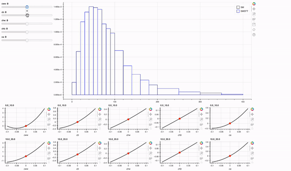
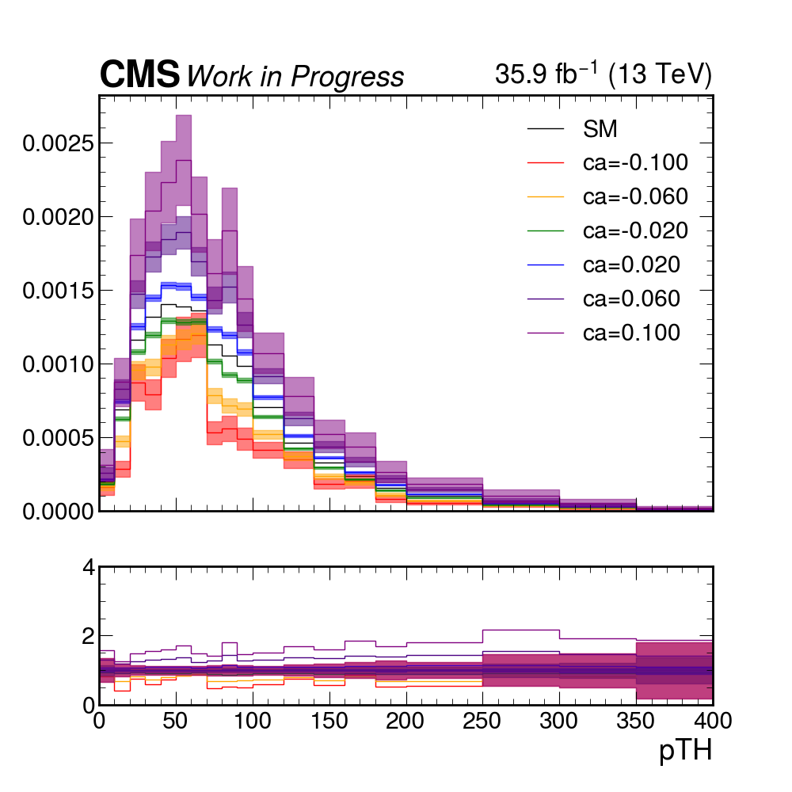
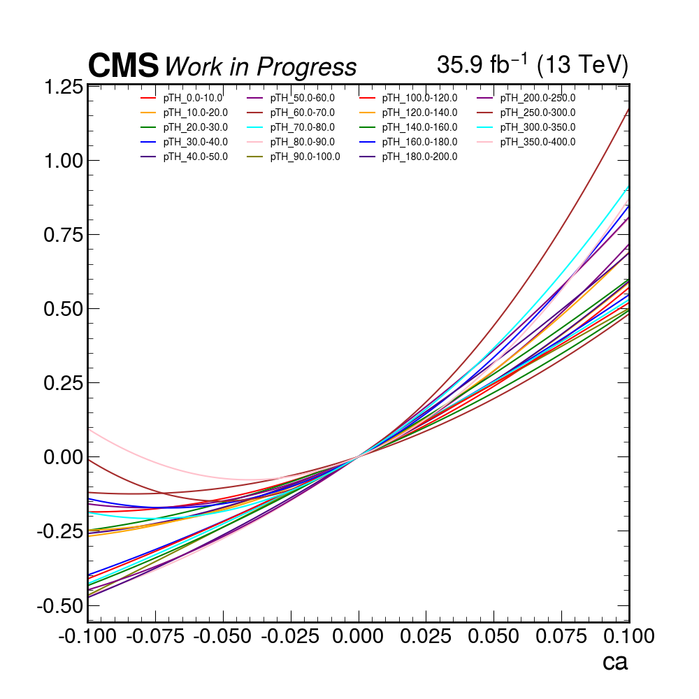

# EFTModelsStudies

Repository containing tools to study SMEFT models and, more specifically, how the variation of Wilson coefficients changes the shape of the Higgs pt.

## ```pt_shape_bokeh.py```

Based on the JSON files produced in the last part of a typical [EFT2Obs](https://github.com/ajgilbert/EFT2Obs) workflow, when running the ```scripts/get_scaling.py``` script. These files are basically dictionaris with the following items:
- edges: list of 2-lists (low and high edge of the bin)
- bins: list containing a list for each bin; each list contains a list in the form [term, term_err, parameter, *other_or_same_parameter] (e.g. ```[3.9, 0.08, 'chw']``` or ```0.35, 0.02, 'cww', 'cb'```)
- parameters: list of Wilson coefficients available (probably useless, since they can be inferred from the previous key)
- areas: list containing the area of each bin in the SM case (this are probably already normalized?)

The assumption is that, in narrow width approximation, the cross section of a Higgs boson produced through gluon fusion and decaying into a certain particle X can be written as:


In order to provide a SMEFT interpretation of the pt shape, the three parts that appear in the last part of the equation have to be parametrized. It can all be done within EFT2Obs, meaning that for each of these parts we end up with a JSON file with the structure described above (details concerning the procedure followed to produce something meaningful can be found [here](https://gist.github.com/maxgalli/7407c634d7d5fa2ab5043ee0e434ba7c)). 

Given this structure, the script accepts three arguments: ```production```, ```br-num``` and ```br-den```. The first one is the only required one, and all three of them accept a path to a JSON file with the structure explained above.

### Run it

If working from a remote server, do the following:

Remote:
```
bokeh serve pt_shape_bokeh.py --allow-websocket-origin=localhost:8006 --args --production tests/HiggsTemplateCrossSections_pT_V.json
```

Then from the local machine, you have to ssh-forward through the port 8006 with the following command:
```
ssh -Y -N -f -L localhost:8006:localhost:5006 gallim@t3ui01.psi.ch
```
(note that 5006 is the remote port where bokeh connects, it is displayed when the server starts). At this point, the interactive plot can be seen when typing in the browser ```http://localhost:8006/pt_shape_bokeh```.

### Preview




## ```plot_shape_matplotlib.py```

Same idea as before, except that here it is not interactive and shapes are plotted. 

Example of command:

```
python plot_shape_matplotlib.py --production tests/HiggsTemplateCrossSections_pT_V.json --observable pTH --output-dir /work/gallim/DifferentialCombination_home/outputs/EFTModelStudies_out
```


<p float="left">
  
   
</p>